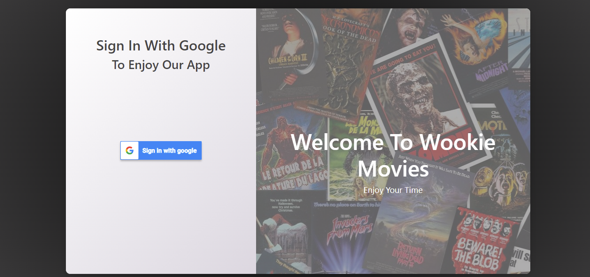
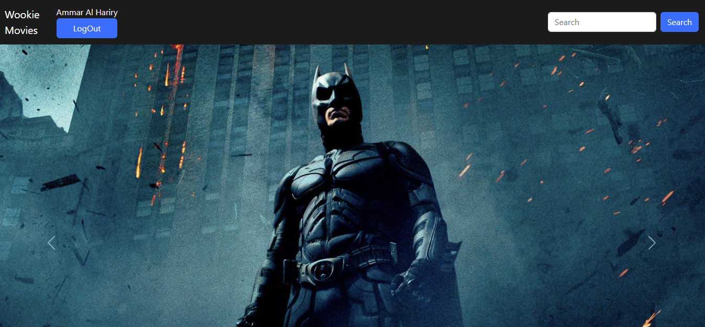
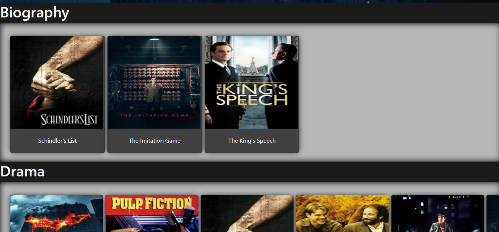
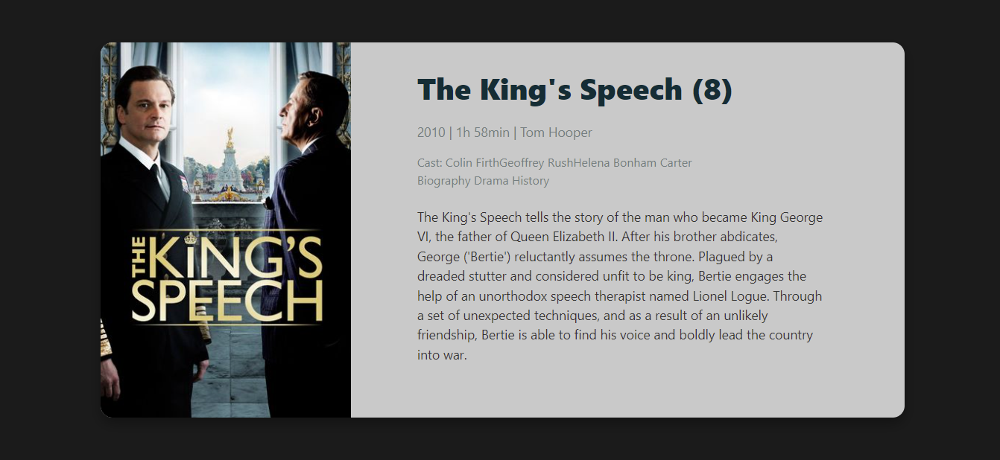
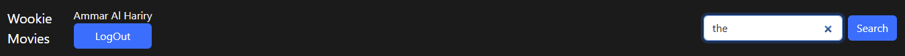
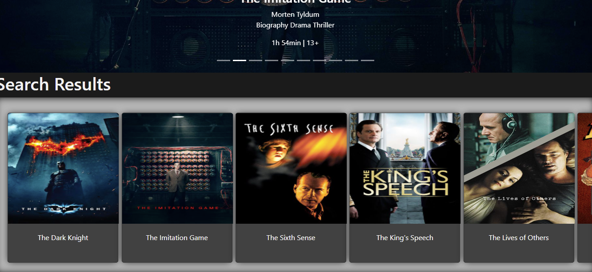
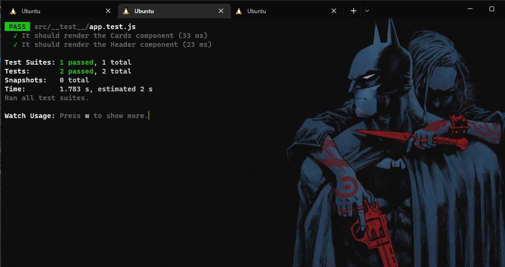
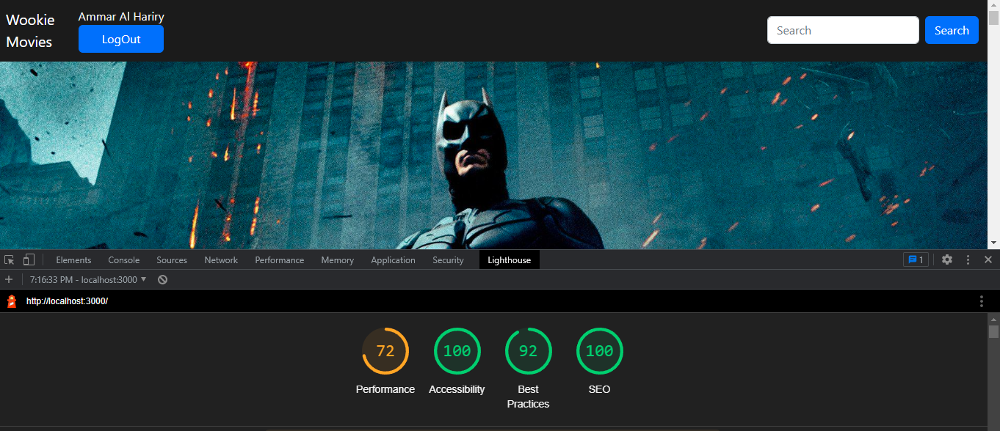
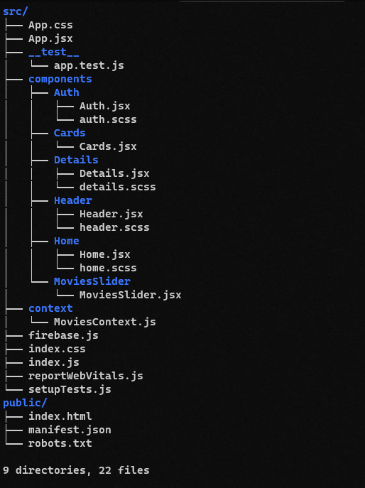

# Wookie-Movies

<b> Wookie-Movies</b> is a free site to browse a big list of movies grouped by their categories.
This website build using <b>React</b> with OAuth authentication provider connected to FireBase.

<b> Wookie-Movies</b> has been built with React's best practices, which means it promotes a clean folder structure and separation of concerns. <b> Wookie-Movies</b> has main responsive page and contains the fundamental building blocks of a scalable React application:

- Auth component (OAuth authentication with Google connected to FireBase)
- LogOut Functionality
- Responsive Home page component that contains list of movies displayed as Cards
- Movie Details component connected with Home component
- Movies customized searching functionality
- Movie slider

## Packages:
-   axios  : for api requests
-   bootstrap: template components & style
-   react-bootstrap:template components & style
-   sass: for styling
-   firebase: OAuth authentication with Google
-   react-cookie: for using cookies

## Wookie-Movies Features:
- Clean folder structure
- Reuseable components
- Lazy-loaded feature modules
- Error logging 
- Shows spinner for all HTTP requests

## How To Use Wookie-Movies:
Start by Cloning the app from GitHub by running the following command:
- if you are using ssh:

``
  git clone git@github.com:Ammarhr/movie-theater.git
`` 
- if you are using https:

``
git clone https://github.com/Ammarhr/movie-theater.git
`` 

Or you can download a zipped version from this link [Download ZIP]([assets/log-in.png](https://github.com/Ammarhr/movie-theater/archive/refs/heads/master.zip))

### Follow the steps below to start using the app.

- Install NodeJS from [NodeJs](https://nodejs.org/en) Page.
- Open Terminal (Download Git Bash for Windows or use cmd)
- Go to your file project
- Run this command in terminal: ``npm install``
- Run React serve for a dev server using ``npm start`` command. Navigate to [http://localhost:3000/](http://localhost:3000/). The app will automatically reload if you change any of the source files.
- Use your favorite IDE to edit the project. 
  
## Demo:
## Auth page:
## Click on -Sign in with Google- button (note that your google account's display name will be shown on the header)

## Home Page:
## Movies slider

## Movies Cards: Click on any movie card to show its own details

## Details page:
## Movie Details

## Search functionality:
## Type a movie name or a part of it then hit search:

## If the search item exists, the result will be as shown below:

## If it's not, the result will be as shown below:

## Click on LogOut button to log out from the site (it will redirect you to Auth page agin): 

## Testing:

## LightHouse report:

 

# Folder Tree:

